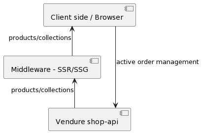

# Vendure Client

A tiny, framework agnostic client for managing active orders and checkout with Vendure.

This package simplifies managing a customers active order. It uses the framework agnostic, and very tiny packages

- [nanostores](https://github.com/nanostores/nanostores) (334 bytes) for state management.
- [mitt](https://www.npmjs.com/package/mitt) (200 bytes) for event emitting

This package should only be used client side, i.e. for fetching an active order, adding to cart, adding shipping details etc.

Handling catalog data, like fetching products and collections, should be handled by your SSR/SSG middleware, like Nuxt, Next.js, Astro or _\<insert your favorite framework here\>_



## Getting started

// TODO

## Extending the client

### Custom graphql fields

// TODO additional fields + typing

### Hooking into events

// TODO: product quantity added, product quantity removed, customer added,

```ts
function logEvent(_type, e) {
  console.log(e);
}

// Subscribe
client.eventBus.on('item-added', logEvent);
// Unsubscribe
client.eventBus.off('item-added', logEvent);
```
