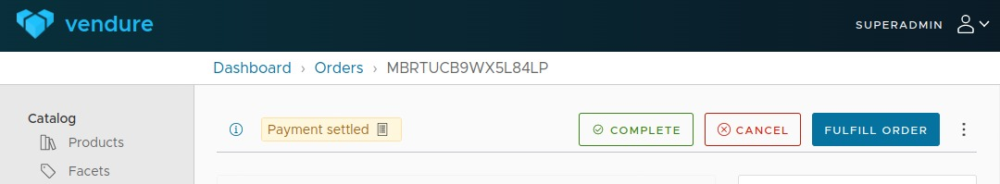

# Vendure Admin UI Helpers plugin

Cancel and complete order buttons for easier completion and cancellation of orders.

## Installation

Add the buttons you want to the AdminUiPlugin config:

```js
import {
  cancelOrderButton,
  completeOrderButton,
} from 'vendure-plugin-admin-ui-helpers';

AdminUiPlugin.init({
  port: 3002,
  route: 'admin',
  app: compileUiExtensions({
    outputPath: path.join(__dirname, '__admin-ui'),
    extensions: [completeOrderButton, cancelOrderButton],
  }),
});
```



## Complete order button

Adds a 'Complete order' to the order detail overview. This moves the order to the `Delivered` state.

## Cancel order button

Adds a 'Cancel order' to the order detail overview. Cancels and refunds the order.

## Enjoying our plugins?

Enjoy the Pinelab Vendure plugins? [Consider becoming a sponsor](https://github.com/sponsors/Pinelab-studio).

Or check out [pinelab.studio](https://pinelab.studio) for more articles about our integrations.
<br/>
<br/>
<br/>
[](https://pinelab.studio)
