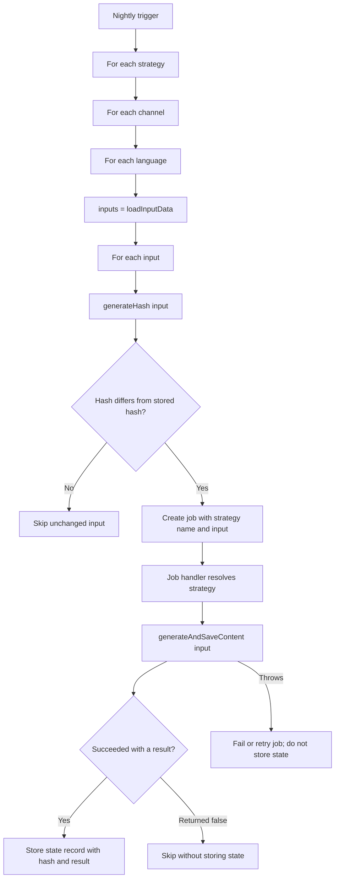

# Content Automation Plugin — High-level Plan

## Why

Vendure projects often need to generate or enrich entity content in bulk. The content may come from an AI model, an external service, a rules engine, or any other consumer-provided implementation.

This plugin provides the shared orchestration for that work:

- process content generation via jobs;
- process every available language for every channel by default;
- avoids regenerating unchanged content;
- keep generation logic outside the plugin through configurable strategies.

The plugin does not prescribe an AI provider or prompt format. Consumers remain responsible for selecting entities and generating their content.

## Main interface

```ts
import { Injector, RequestContext, ID } from '@vendure/core';

interface ContentAutomationResult {
  resultMessage?: String; // Free text message format, e.g. ''
  entityUrl?: string; // Optional Dashboard URL for viewing the entity.
}

/**
 * Definition of a content automation strategy.
 * A Vendure project can have multiple automation strategies. For example a product description automation strategy and a variant 'usage' content strategy
 */
interface ContentAutomationStrategy<TInput = { id: ID }> {
  // TInput has to be serializable!
  name: string; // Stable, unique key, e.g. "product-description-ai"

  /**
   * Called once per language per channel.
   * The consumer should return an array of all input data needed to generate content for this strategy
   */
  loadInputData(ctx: RequestContext, injector: Injector): Promise<TInput[]>;

  /**
   * Returns a deterministic fingerprint of source fields relevant to generation.
   *
   * Generate hash is optional: By default the plugin generates a hash from all fields in the input
   */
  generateHash?(ctx: RequestContext, input: TInput): string;

  /**
   * Generates and applies content to the entity. This may call AI, an external API, or local code.
   * !! The consumer is in charge of saving the entity inside the generateContent!
   * Return false to intentionally skip the entity for the current hash and language.
   * Throw an error for transient failures so the job can fail/retry without storing the new hash.
   */
  generateAndSaveContent(
    ctx: RequestContext,
    injector: Injector,
    inputData: TInput
  ): Promise<ContentAutomationResult | false>;
}

/**
 * The actual config input for the Content Automation Plugin
 */
interface ContentAutomationPluginOptions {
  // Different strategies may automate different entity types or use different content providers.
  automationStrategies: Array<ContentAutomationStrategy>;
}
```

## Consumer example (pseudocode)

```ts
import { Product } from '@vendure/core';

/**
 * The input needed for each product+language to generate meta title and decription
 */
interface MetaTagsInput {
  id: ID;
  description: string;
}

/**
 * A strategy to auto generate meta title and description based on the product data
 */
class ProductMetaTagsAutomation
  implements ContentAutomationStrategy<MetaTagsInput>
{
  name = 'product-metatags-ai'; // Stable key used in persisted processing state.

  // Called separately for every ctx.languageCode.
  async loadInputData(
    ctx: RequestContext,
    injector: Injector
  ): Promise<MetaTagsInput[]> {
    const products = await injector.getRepository(Product).findAll();
    return products.map((p) => ({
      productId: p.id,
      description: p.description,
    }));
  }

  generateHash(ctx: RequestContext, input: MetaTagsInput): string {
    return sha256(input.id, input.description);
  }

  async generateAndSaveContent(
    ctx: RequestContext,
    injector: Injector,
    input: MetaTagsInput
  ): Promise<ContentAutomationResult | false> {
    if (!input.description.trim()) {
      return false; // Can't generate meta tags without description
    }

    const { metaTitle, metaDescription } = await ai.generate(
      'Generate a meta title and description for this description',
      input.description
    );
    await injector.getRepository(Product).update(ctx, {
      id: input.id,
      customfields: {
        metaTitle,
        metaDescription,
      },
    });
    return {
      entityUrl: `/dashboard/product/${input.id}`,
      resultMessage: 'Updated meta title and description with Jev',
    };
  }
}

ContentAutomationPlugin.init({
  automationStrategies: [new ProductMetaTagsAutomation()],
});
```

## Processing flow



Every night, the Vendure scheduled task iterates through every strategy, channel, and language. It calls `loadInputData()`, generates a hash for each returned input, and compares that hash with the stored state. An unchanged input is skipped. For a changed input, the plugin creates a background job containing the strategy name and input. The job handler resolves the strategy and calls `generateAndSaveContent()`. Only a successful result creates a state record.

## Store updates

The plugin stores any updates/mutations made. If content generation was skipped, no record is created

Updates are persisted as a custom Vendure entity:

```ts
export class ContentAutomationUpdate extends VendureEntity {
  // `id` and `updatedAt` are inherited from VendureEntity.
  strategyName: string;
  channelId: ID;
  languageCode: LanguageCode;
  hash: string; // The calculated hash AFTER generation.
  resultMessage?: string; // E.g. 'Updated meta title and description'.
  entityUrl?: string;
}
```

The new hash is stored only after `generateAndSaveContent()` completes successfully and returns a result. A deliberate `false` result does not create a state record, so that input may be offered to the strategy again the next night.

## Decisions and limitations

- Strategies define their own input type and return all required input data from `loadInputData()` once per language and channel.
- Strategies own entity persistence inside `generateAndSaveContent()`, allowing them to use the appropriate Vendure service, repository, validation, events, and side effects.
- The nightly task creates one job per changed input.
- Generation state is language- and channel-specific to prevent one context from suppressing another.
- Generation implementation is totally up to the consumer

# Important not to forget when refining the task and implementing:

// Dedicated dashboard page using Vendure's datatable. This table shows the ContentAutomationUpdate entities
// Thorough Testing is needed, but does not have to include AI: the plugin is just a framework for calling 'something' and updating entities, we just need to test and validate that generateAndSaveContent is called in the right circumstances and when it should be skipped
// An initial population script should be included to prevent too many concurrent job iwth an empty state. The script will do the same as general flow, but not create jobs, instead process sequentially
