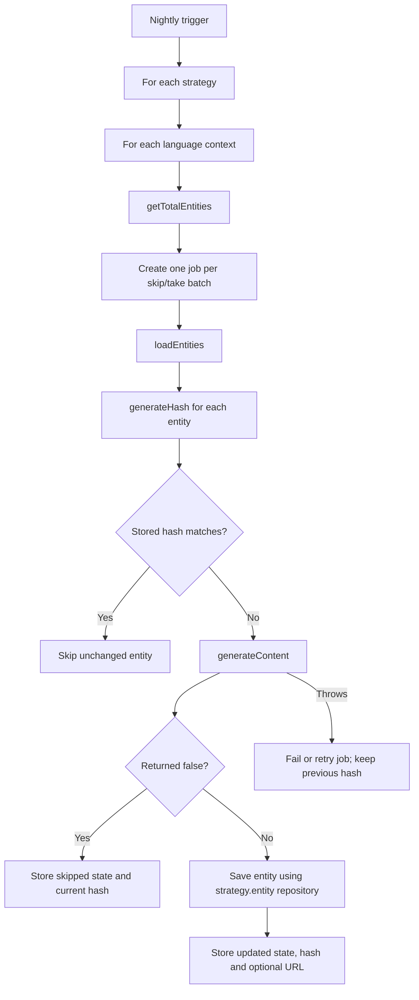

# Content Automation Plugin — High-level Plan

## Why

Vendure projects often need to generate or enrich entity content in bulk. The content may come from an AI model, an external service, a rules engine, or any other consumer-provided implementation.

This plugin provides the shared orchestration for that work:

- process entities in batches;
- process every available language by default;
- avoid regenerating unchanged content;
- run expensive work through Vendure's job queue; and
- keep generation logic outside the plugin through configurable strategies.

The plugin does not prescribe an AI provider or prompt format. Consumers remain responsible for selecting entities and generating their content.

## Main interface

```ts
import { ID, InjectableStrategy, RequestContext, Type } from '@vendure/core';

interface ContentAutomationResult<T> {
  entity: T; // The changed entity which the plugin will save generically.
  entityUrl?: string; // Optional Dashboard URL for viewing the entity.
}

interface ContentAutomationStrategy<T extends { id: ID }>
  extends InjectableStrategy {
  name: string; // Stable, unique key, e.g. "product-description-ai"

  entity: Type<T>; // Explicit TypeORM entity target used to obtain the repository. This is safer than inferring entity.constructor.

  // Called once for every language. ctx.languageCode identifies the language currently being processed.
  // Returns the number of entities for that language so the plugin can create batch jobs.
  getTotalEntities(ctx: RequestContext): Promise<number>;

  // Called by each batch job. The query must filter for ctx.languageCode and use deterministic ordering.
  // An empty array means that there are no entities in this batch.
  loadEntities(ctx: RequestContext, skip: number, take: number): Promise<T[]>;

  // Returns a deterministic fingerprint of source fields relevant to generation.
  // Generated output fields must not be included, or every generated update would change the next hash.
  generateHash(ctx: RequestContext, entity: T): string;

  // Generates and applies content to the entity. This may call AI, an external API, or local code.
  // Return false to intentionally skip the entity for the current hash and language.
  // Throw an error for transient failures so the job can fail/retry without storing the new hash.
  generateContent(
    ctx: RequestContext,
    entity: T
  ): Promise<ContentAutomationResult<T> | false>;
}

interface ContentAutomationPluginOptions {
  // Different strategies may automate different entity types or use different content providers.
  automationStrategies: Array<ContentAutomationStrategy<any>>;
}
```

Strategies extend Vendure's `InjectableStrategy`. They can use `init(injector)` to obtain services needed by their methods instead of receiving an `Injector` on every call.

All available languages are processed by default. A strategy can return `false` from `generateContent()` when it does not support a particular `ctx.languageCode`. Returning `false` will still save the hash, because this has should be considered processed now

## Processing flow



Scheduling details are intentionally outside the scope of this decision. The intended implementation is a Vendure scheduled task which creates background jobs.

## Stored processing state

The plugin stores one state record per strategy, channel, language, and entity. Its unique identity is equivalent to:

```txt
<strategy-name>:<channel-id>:<language-code>:<entity-id>
```

A state record contains at least:

```ts
{
    strategyName,
    channelId,
    languageCode,
    entityId,
    hash,
    status,       // "updated" or "skipped"
    entityUrl,
    updatedAt,
}
```

The new hash is stored only after the generated entity has been saved successfully. A deliberate `false` result is stored as `skipped`; otherwise an excluded language would be offered to the strategy again every night.

## Consumer example (pseudocode)

This example generates translated product descriptions. The product name and selected attributes are source data; the generated description is deliberately excluded from the hash.

```ts
class ProductDescriptionAutomation
  implements ContentAutomationStrategy<ProductTranslation>
{
  name = 'product-description-ai'; // Stable key used in persisted processing state.
  entity = ProductTranslation; // Lets the plugin save through the correct repository.

  private connection: TransactionalConnection;
  private ai: MyAiClient;

  // Vendure initializes the strategy once, allowing it to resolve consumer services.
  init(injector: Injector) {
    this.connection = injector.get(TransactionalConnection);
    this.ai = injector.get(MyAiClient);
  }

  // Called separately for every ctx.languageCode.
  getTotalEntities(ctx: RequestContext): Promise<number> {
    return this.connection
      .getRepository(ctx, ProductTranslation)
      .count({ where: { languageCode: ctx.languageCode } });
  }

  // Pseudocode: the actual query should use a stable order and load all prompt inputs.
  loadEntities(ctx: RequestContext, skip: number, take: number) {
    return this.connection
      .getRepository(ctx, ProductTranslation)
      .createQueryBuilder('translation')
      .leftJoinAndSelect('translation.base', 'product')
      .leftJoinAndSelect('product.facetValues', 'facetValue')
      .where('translation.languageCode = :languageCode', {
        languageCode: ctx.languageCode,
      })
      .orderBy('translation.id', 'ASC')
      .skip(skip)
      .take(take)
      .getMany();
  }

  generateHash(ctx: RequestContext, translation: ProductTranslation): string {
    return hash({
      generationVersion: 'v1', // Change when the prompt/model/config should regenerate all content.
      languageCode: ctx.languageCode,
      productName: translation.name,
      attributes: translation.base.facetValues
        .map((value) => value.code)
        .sort(),
      // Do not hash translation.description: it is generated output.
    });
  }

  async generateContent(
    ctx: RequestContext,
    translation: ProductTranslation
  ): Promise<ContentAutomationResult<ProductTranslation> | false> {
    // A strategy can opt out of individual languages.
    if (!this.ai.supports(ctx.languageCode)) return false;

    translation.description = await this.ai.generateDescription({
      languageCode: ctx.languageCode,
      productName: translation.name,
      attributes: translation.base.facetValues,
    });

    return {
      entity: translation,
      entityUrl: `/products/${translation.base.id}`,
    };
  }
}

ContentAutomationPlugin.init({
  automationStrategies: [new ProductDescriptionAutomation()],
});
```

For every changed result, the plugin conceptually performs:

```ts
await connection.getRepository(ctx, strategy.entity).save(result.entity);

await automationStateRepository.upsert({
  strategyName: strategy.name,
  channelId: ctx.channelId,
  languageCode: ctx.languageCode,
  entityId: result.entity.id,
  hash: generatedHash,
  status: 'updated',
  entityUrl: result.entityUrl,
});
```

## Decisions and limitations

- `entity: Type<T>` is explicit rather than inferred. Inferring from `entity.constructor` is less type-safe and can be unreliable for proxies or plain objects.
- Generic repository saving keeps the strategy interface small, but it bypasses entity-specific Vendure services and their validation, events, and side effects. Consumers must only return entities which are safe to persist this way.
- Offset pagination requires deterministic ordering. Concurrent inserts or deletions can still shift batches; cursor-based pagination can be considered later if this becomes a practical issue.
- Generation state is language- and channel-specific to prevent one context from suppressing another.
- Consumers should include a prompt, model, or implementation version in the hash when such changes must regenerate otherwise unchanged entities.
- The interface does not depend on a particular AI SDK or external service.

# Not for now, but important not to forget when refining the task:

// Custom entity "UpdatedEntities" that has a log of whenever the plugin updates an entity: id, updatedAt, entityAdminLink.
// Dedicated dashboard page using Vendure's datatable. This table shows the UpdatedEntities
// Thorough Testing is needed, but does not have to include AI: the plugin is just a framework for calling 'something' and updating entities, we just need to test and validate that generateContent is called in the right circumstances and when it should be skipped
// An initial population script should be included to prevent too many concurrent job iwth an empty state. The script will do the same as general flow, but not create jobs, instead process sequentially
