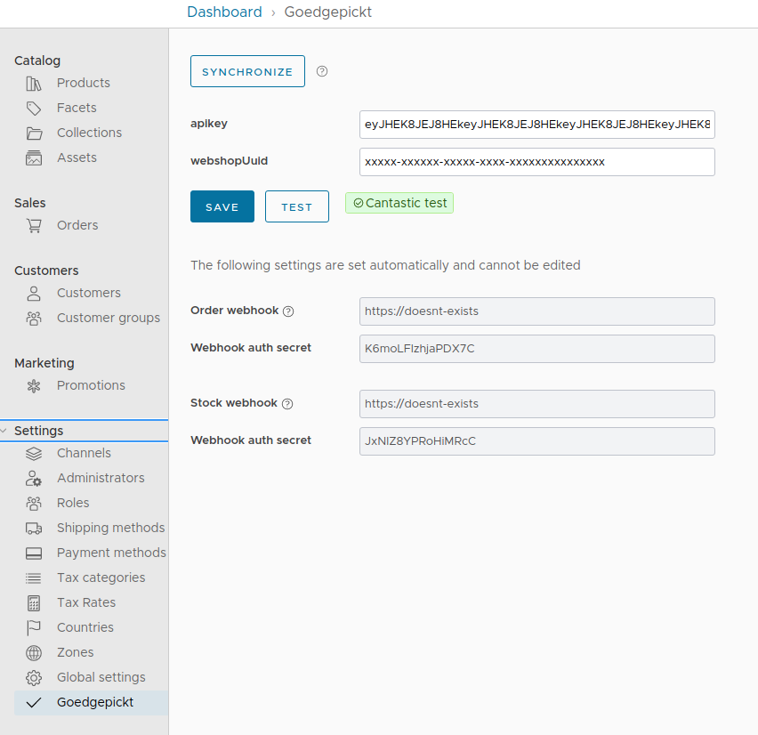

# Vendure GoedGepickt plugin

Plugin for integration with GoedGepickt. The seperation between Vendure and GoedGepickt is as follows:

- Vendure is your catalog. If you want a new product, add it in Vendure and synchronize via the Admin UI.
- GoedGepickt manages all things stock related. StockLevel, size and weight are all managed by GoedGepickt.

## Plugin setup

The plugin needs some static config in `vendure-config.ts` and dynamic per-channel config that can be set via the Admin
UI.

### Vendure config

Add this to your plugin in `vendure-config.ts`:

```js
plugins: [
  ...
    GoedgepicktPlugin.init({
      vendureHost: tunnel.url,
      endpointSecret: 'some-secret', // Used to validate incoming requests to /fullsync
      setWebhook: true // set webhooks in Goedgepickt or not
    }),
  ...
]
```

### Database migration

Run a database migration to add the new fields and entities to your database.
https://www.vendure.io/docs/developer-guide/migrations/

### Admin UI

Add this plugin to your Admin UI and compile.

```js
compileUiExtensions({
  outputPath: path.join(__dirname, '__admin-ui'),
  extensions: [
    ...
      GoedgepicktPlugin.ui,
    ...
  ]
```

Read more about Admin UI compilation in the Vendure
docs https://www.vendure.io/docs/plugins/extending-the-admin-ui/#compiling-as-a-deployment-step

### Credentials via Admin UI

You can configure your `apiKey` and `webshopUuid` per channel via the Vendure Admin UI via Settings > GoedGepickt. The
button `test`
calls the API with the filled in credentials to verify if the credentials are correct.

When you save the credentials, the plugin will make sure the configured vendureHost is set as webhook for order and
stock updates. **The plugin will never delete webhooks**, so if you ever change your url, you should manually delete the
old webhook via GoedGepickt.

## Event based syncs

Stocklevels in Vendure will be updated by incoming webhook events from GoedGepickt.

Vendure variants will be pushed to GoedGepickt on product variant creation events. Name, price and image updates are
only done by full sync.

## Full sync

Full sync:

1. Pushes all products in Vendure to GoedGepickt. Products are matched by SKU.
2. Pulls stocklevels from GoedGepickt and updates in Vendure.

Full sync creates jobs with batches of products for both stocklevel updates and product pushes. GoedGepickt has rate
limit, so some jobs might fail and should be retried with exponential backoff for the sync to succeed.

Full sync can be run manually via the Admin ui or via a GET request to endpoint`/goedgepickt/fullsync/<webhook-secret>/`
. Full sync can be resource heavy, so use with care.

## Pickup points / drop off points

This plugin uses custom fields on an order as pickup location address. You can set a pickup points on an order with this
mutation, the plugin will then send the address to Goedgepickt:

```graphql
mutation {
  setOrderCustomFields(
    input: {
      customFields: {
        pickupLocationNumber: "1234"
        pickupLocationCarrier: "1"
        pickupLocationName: "Local shop"
        pickupLocationStreet: "Shopstreet"
        pickupLocationHouseNumber: "13"
        pickupLocationZipcode: "8888HG"
        pickupLocationCity: "Leeuwarden"
        pickupLocationCountry: "nl"
      }
    }
  ) {
    ... on Order {
      id
      code
    }
    ... on NoActiveOrderError {
      errorCode
      message
    }
  }
}
```

## How this plugin works

### Run full sync via Admin UI

This is a manual action. Via the Admin UI you can trigger a full sync. A full sync:

1. Pushes all products in Vendure to GoedGepickt. Products are matched by SKU.
2. Pulls stocklevels from GoedGepickt and updates in Vendure.
3. Sets/verifies webhook set on GoedGepickt account

This action is synchronous, so the Admin UI will provide you feedback if the action succeeded or not.

### Order fulfillment

This plugin will push orders to GoedGepickt on order fulfillment by Vendure. GoedGepickt calls a webhook that will
update the order status in Vendure.

### Stocklevels

Stocklevels are updated in Vendure:

1. Via full sync via UI also pulls all stocklevels from GoedGepickt. This is synchronous in the mainprocess, so we can
   provide feedback to the user.
2. Via stockUpdate per variant webhook from GoedGepickt.



## Enjoying our plugins?

Enjoy the Pinelab Vendure plugins? [Consider becoming a sponsor](https://github.com/sponsors/Pinelab-studio).

Or check out [pinelab.studio](https://pinelab.studio) for more articles about our integrations.
<br/>
<br/>
<br/>
[](https://pinelab.studio)
