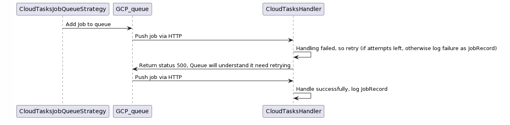

# Google Cloud Tasks Vendure plugin


Plugin for using Vendure worker with Google Cloud Tasks. This plugin will show ending, successful and failed jobs in the admin UI under `sytem/jobs`, but not running jobs. Only jobs of the past 7 days are kept in the DB.

## Getting started

## Plugin setup

1. `yarn add vendure-plugin-google-cloud-tasks`
2. Remove `DefaultJobQueuePlugin` from your vendure-config. Add this plugin to your `vendure-config.ts`:

```ts
import { CloudTasksPlugin } from 'vendure-plugin-google-cloud-tasks';

plugins: [
  CloudTasksPlugin.init({
    // Must reachable by Google Cloud Task. Messages are pushed to this endpoint
    taskHandlerHost: 'https://your-public-host/',
    projectId: 'your-google-project-id',
    // Region where the taskqueue should be created
    location: 'europe-west1',
    // Used to prevent unauithorized requests to your public endpoint
    authSecret: 'some-secret-to-authenticate-incoming-messages',
    /**
     *  Used to distinguish taskQueues within the same
     *  Google Project (if you have OTAP environments in the same project for example)
     *  This suffix will be appended to the queue name: "send-email-plugin-test"
     */
    queueSuffix: 'plugin-test',
    // Default amount of retries when no job.retries is given
    defaultJobRetries: 15,
    // The amount of retries when a job fails to be pushed to the queue
    createTaskRetries: 3,
  }),
];
```

2. Start the Vendure server, log in to the admin dashboard and trigger a reindex job
   via `Products > (cog icon) > reindex` to test the Cloud Tasks Plugin.

# Overview



(Use this to edit the diagram on plantuml.com: `//www.plantuml.com/plantuml/png/jL0zJyCm4DtzAzu8Kf2wi7H0HHsec4h9ZanyQGqN6tntLFdtEAb49If6Dkjz-DvxAr5Vr0PsRitPGklbNHxpwvEHqRCMhxGVSNE7X_NsvNC2bxWF0LK2pPWHzyDDmlCt6vy2KrbYQtB0MtLyHOzDssxTXUWFv_o8QO_UHwRGG38AQHbn5NjuLHe-LC3KQuEi1oh7A0JE9uSLWfSfx8wwNCBrvU5VtNQaLXBgAcg2syMYmJm5Zf4PbWALogM0g4X4uPIc9lpl4GXYNKSYlJ6FpLJntCkv5QLW0ty3`)
