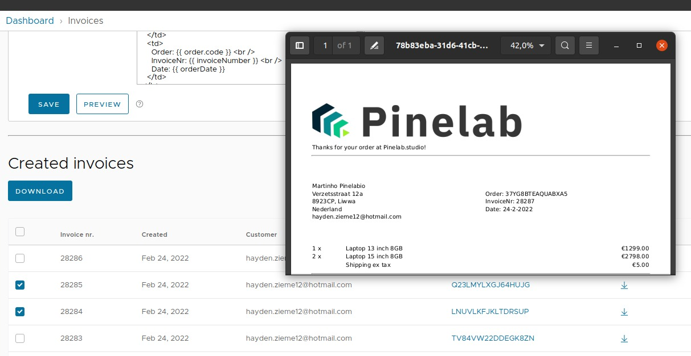
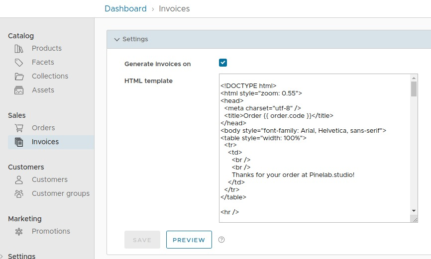
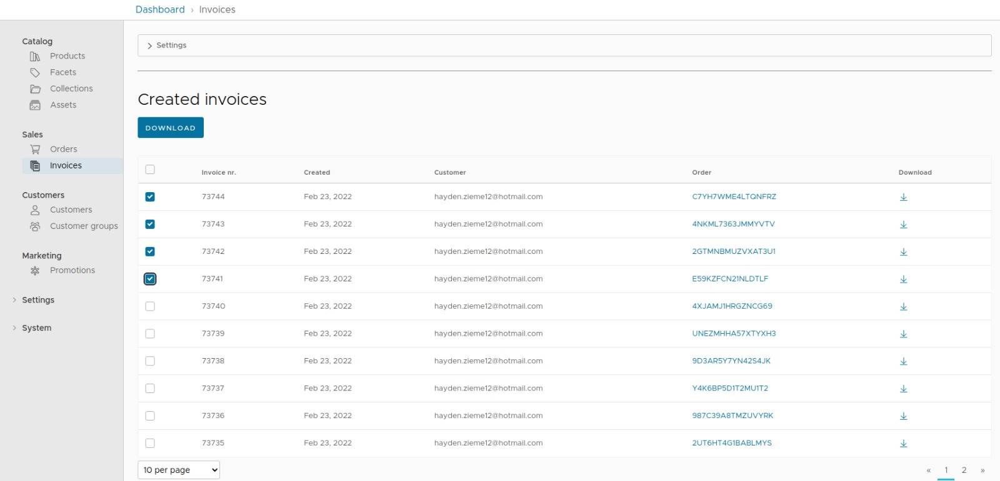

# Vendure Plugin for generating invoices


A plugin for generating PDF invoices for placed orders.

- View created invoices via the Vendure admin
- Set templates per channel
- Preview HTML templates before using them
- Download multiple pdf's as zip
- Easily implement your own storage strategy
- Pass custom data to your custom HTML template



## Getting started

1. Add the following config to your `vendure-config.ts`:

```ts
plugins: [
  InvoicePlugin.init({
    // Used as host for creating downloadUrls
    vendureHost: 'http://localhost:3106',
  }),
  AdminUiPlugin.init({
    port: 3002,
    route: 'admin',
    app: compileUiExtensions({
      outputPath: path.join(__dirname, '__admin-ui'),
      extensions: [InvoicePlugin.ui],
      devMode: true,
    }),
  }),
];
```

2. Run a [migration](https://www.vendure.io/docs/developer-guide/migrations/), because this plugin adds 2 entities to the db.
3. Start Vendure and navigate to the admin
4. Make sure you have the permission `AllowInvoicesPermission`
5. Go to Sales > Invoices.
6. Unfold the `settings` accordion.
7. Check the checkbox to enable invoice generation for the current channel on order placement.
8. A default HTML template is set for you. Click the `Preview` button to view a sample PDF invoice.

The bottom table holds an overview of already generated invoices.

## Adding invoices to your order-confirmation

Invoices are generated via the worker and are not available when order confirmations are send. What you can do is add
the following link to your email:

`https://<your server>/invoices/e2e-default-channel/C7YH7WME4LTQNFRZ?email=hayden.zieme12@hotmail.com`.

The server will check if the ordercode belongs to the given channel AND the given customer emailaddress. If so, it will
return the invoice.

## Admin UI

The Vendure admin can be used to view created invoices and change invoice settings. Make sure you
have `AllowInvoicesPermission` for the 'Invoices' menu item to show.



## Google storage strategy

This plugin also includes a strategy for storing invoices in Google Storage. Install the gcloud package and set the following config:

`yarn add @google-cloud/storage`

```ts
InvoicePlugin.init({
  vendureHost: 'http://localhost:3050',
  storageStrategy: new GoogleStorageInvoiceStrategy({
    bucketName: 'bucketname',
  }),
});
```

The strategy will use the projectId and credentials in from your environment, so if you are running in Cloud Functions
or Cloud Run you should be fine with this config.

:warning: However, if you want to run it locally or on some other environment, use this:

```ts
InvoicePlugin.init({
  vendureHost: 'http://localhost:3050',
  storageStrategy: new GoogleStorageInvoiceStrategy({
    bucketName: 'bucketname',
    storageOptions: {
      keyFilename: 'key.json',
    },
  }),
});
```

This is needed to generate signedUrls, which are used to give customers temporary access to a file on Storage. See this
info for info about locally using signedUrls: https://github.com/googleapis/nodejs-storage/issues/360

## Custom file storage

Implement your own strategy for storing invoices by implementing one of these interfaces:

- `RemoteStorageStrategy` for storing PDF files on an external platform like Google Cloud or S3.
- `LocalFileStrategy` streams the invoice through the Vendure service to the user.

```ts
import { RemoteStorageStrategy, zipFiles } from 'vendure-plugin-invoices';

export class YourRemoteStrategy implements RemoteStorageStrategy {
  async save(
    tmpFile: string,
    invoiceNumber: number,
    channelToken: string
  ): Promise<string> {
    // Save the invoice in your favorite cloud storage. The string you return will be saved as unique reference to your invoice.
    // You should be able to retrieve the file later with just the unique reference
    return 'unique-reference';
  }

  async getPublicUrl(invoice: InvoiceEntity): Promise<string> {
    // Most cloud based storages have the ability to generate a signed URL, which is available for X amount of time.
    // This way the downloading of invoices does not go through the vendure service
    return 'https://your-signed-url/invoice.pdf';
  }

  async streamMultiple(
    invoices: InvoiceEntity[],
    res: Response
  ): Promise<ReadStream> {
    // zip files and return stream
    const zipped = zipFiles(files);
    return createReadStream(zipped);
  }
}
```

## Custom invoice numbering and custom data

Implement the `DataStrategy` to pass custom data to your template or generate custom invoicenumbers:

```ts
export class DefaultDataStrategy implements DataStrategy {
  async getData({
    ctx,
    injector,
    order,
    latestInvoiceNumber,
  }: DataFnInput): Promise<InvoiceData> {
    return {
      invoiceNumber: String(Math.floor(Math.random() * 90000) + 10000),
      customerEmail: 'just used for admin display',
      order,
      someCustomField: '2022',
    };
  }
}
```

You can access this data in your HTML template using Handlebars.js:

```html
<h1>{{ someCustomField }}</h1>
```

## Contributing

Contributions always welcome! Just create a PR on Github. The commands you need:

```shell
# Run e2e test
yarn test

# Start server with auto-reloading admin UI
yarn start

# Serve auto-reloading backend. This sometimes messes with phantom processes
# from admin ui compilation. You might want to disable admin compilation
# in dev-server.ts if you use this
yarn serve
```

Reach out to me at [pinelab.studio](https://pinelab.studio) if you need any help.
[](https://pinelab.studio)
