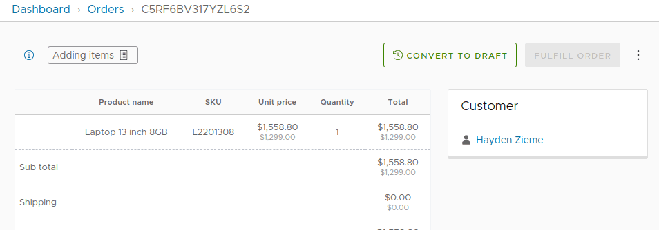

# Modify Customer Orders plugin

This plugin allows you to convert an active order from a customer to a Draft order, edit it, and connect it back to the customer.

## Getting started

```ts
// vendure-config.ts
import { ModifyCustomerOrdersPlugin } from 'vendure-plugin-modify-customer-orders';

plugins: [
  ModifyCustomerOrdersPlugin.init({
    /**
     * Automatically make completed draft orders active orders for the connected customer
     */
    autoAssignDraftOrdersToCustomer: true,
  }),
  AdminUiPlugin.init({
    port: 3002,
    route: 'admin',
    app: compileUiExtensions({
      outputPath: path.join(__dirname, '__admin-ui'),
      extensions: [ModifyCustomerOrdersPlugin.ui], // Add the "Convert to draft" button
      devMode: true,
    }),
  }),
];
```


