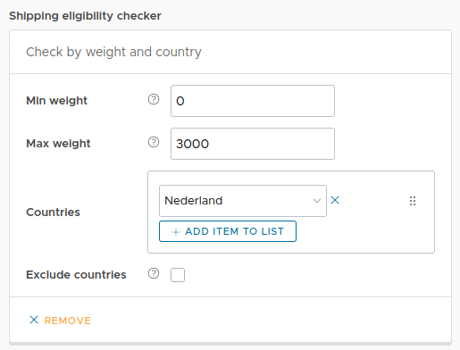
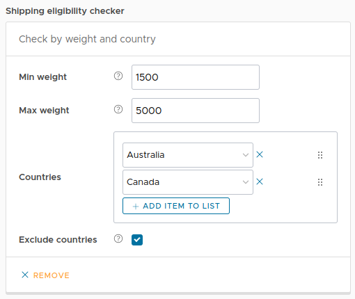

# Shipping by weight and country

This plugin adds a shipping eligibility checker to Vendure that checks the total weight and the shipping country of an
order, to verify if a shipping method is eligible for a given order.

The weight of a product can be configured on the customfield `Product.weight`. You can configure the units to be in KG,
grams or whatever unit you like.

Some examples:

- Create a shippingmethod for orders placed in Australia, with a total order weight between 10kg and 40kg
- Create a shippingmethod for all orders except the ones placed in Canada and Norway, with a total order weight below
  1100 grams

## Plugin setup

Add the following to the plugins in `vendure-config.ts`:

```ts
plugins: [
  ...
    ShippingByWeightAndCountryPlugin.init({
      /**
       * Weight unit used in the eligibility checker
       * and product customfield.
       * Only used for displaying purposes
       */
      weightUnit: "kg",
      /**
       * The name of the tab the customfield should be added to
       * This can be an existing tab
       */
      customFieldsTab: "Physical properties"
    })
  ...
]
```

## Admin configuration

1. Start your server
2. Login to the admin UI and go to `Shipping methods`
3. Create a new shippingmethod
4. Under `Shipping eligibility checker` you should see `Check by weight and country`

This checker can be used to have a shippingmethod eligible for an order based on the total weight and shipping country
of an order.

### Examples

Example 1 - Eligible for orders with shipping country Nederland (NL) with a weight below 3000 grams.


Example 2 - Eligible for orders in all countries except Australia and Canada, with a weight between 1500 and 5000 grams

