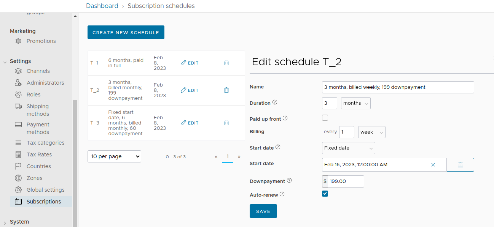
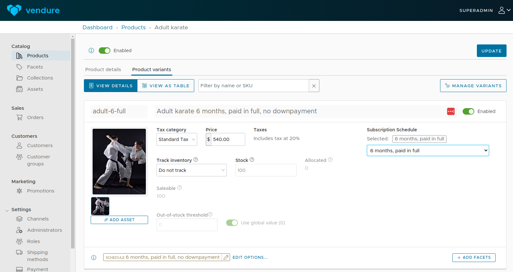
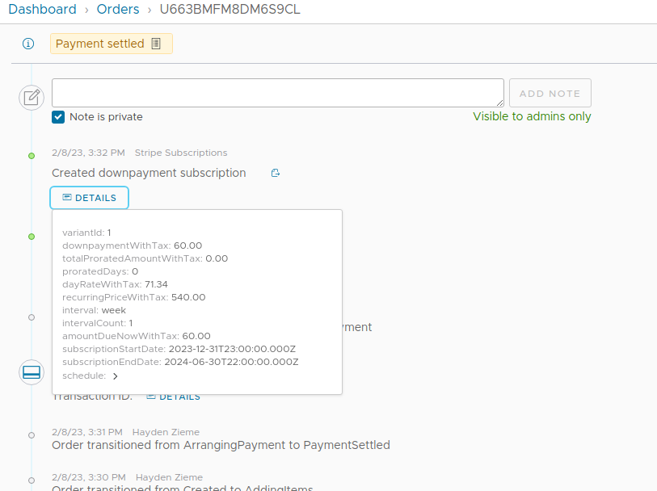
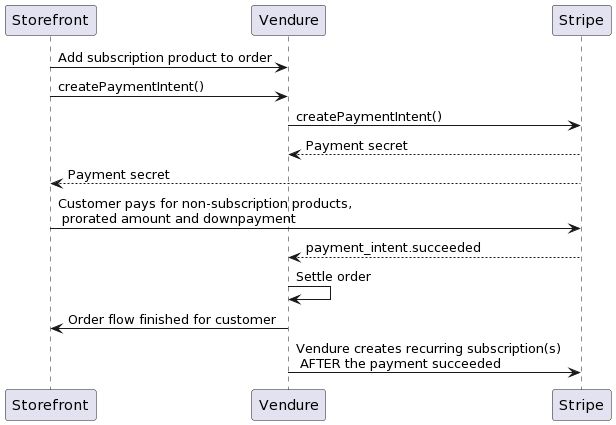
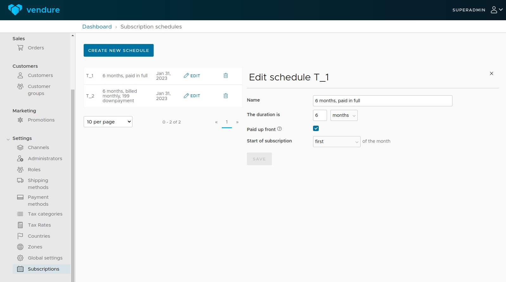

// TODO: Strategy explained. Failed invoice event
// No support for non-recurring payments. Use the built Vendure plugin for that. Only for recurring payments

# Vendure Stripe Subscription plugin


A channel aware plugin that allows you to sell subscription based services or memberships through Vendure. Also support
non-subscription payments. This plugin was made in collaboration with the great people
at [isoutfitters.com](https://isoutfitters.com/).

## How it works

A few things you should know before getting started:

- Subscriptions are defined by `Schedules`. A schedule is a blueprint for a subscription and can be reused on multiple
  subscriptions. An example of a schedule is
  `Billed every first of the month, for 6 months`.
- Schedules have a fixed duration. Currently, they do autorenew after this duration. The duration is used to calculate
  prorations and down payment deductions. Read more on this under [Advanced features](#advanced-features)
- By connecting a `Schedule` to a ProductVariant, you turn the variant into a subscription. The price of the variant is
  the price a customer pays **per interval**.

  
_Managing schedules in the Admin UI_

  
_Connecting a schedule to a product variant_

### Examples of schedules

A variant with price $30,- and schedule `Duration of 6 months, billed monthly` is a subscription where the customer is
billed $30,- per month for 6 months.

A variant with price $300 and a schedule of `Duration of 12 months, billed every 2 months` is a subscription where the
customer is billed $300 every 2 months, for a duration of 12 months.

Currently, subscriptions auto-renew after their duration: After 12 months, the customer is again billed $300 per 2
momnths for 12 months.

## Getting started

### Setup Stripe webhook

1. Go to Stripe > developers > webhooks and create a webhook to `https://your-vendure.io/stripe-subscriptions/webhook`
2. Select the following events for the webhook: `payment_intent.succeeded`, `invoice.payment_succeeded` and `invoice.payment_failed`

## Vendure setup

3. Add the plugin to your `vendure-config.ts` plugins and admin UI compilation:

```ts
import { StripeSubscriptionPlugin } from 'vendure-plugin-stripe-subscription';

plugins: [
  StripeSubscriptionPlugin,
  AdminUiPlugin.init({
    port: 3002,
    route: 'admin',
    app: compileUiExtensions({
      outputPath: path.join(__dirname, '__admin-ui'),
      extensions: [StripeSubscriptionPlugin.ui],
    }),
  }),
];
```

5. Run a migration to add the `Schedule` entity and custom fields to the database.
6. Start the Vendure server and login to the admin UI
7. Go to `Settings > Subscriptions` and create a Schedule.
8. Create a variant and select a schedule in the variant detail screen in the admin UI.
9. Create a payment method with the code `stripe-subscription-payment` and select `stripe-subscription` as handler. You can (and should) have only 1 payment method with the Stripe Subscription handler per channel.
10. Set your API key from Stripe in the apiKey field.
11. Get the webhook secret from you Stripe dashboard and save it on the payment method.

## Storefront usage

1. From your storefront, add the subscription variant to your order
2. Add a shipping address and a shipping method to the order (mandatory for all orders).
3. Call the graphql mutation `createStripeSubscriptionIntent` to receive the Payment intent token.
4. Use this token to display the Stripe form on your storefront. See
   the [Stripe docs](https://stripe.com/docs/payments/accept-a-payment?platform=web&ui=elements#set-up-stripe.js) on how
   to accomplish that.
5. During the checkout the user is only charged any potential down payment or proration (
   see [Advanced features](#advanced-features)). The recurring charges will occur on the start of the schedule. For
   paid-up-front schedules the customer pays the full amount during checkout
6. Have the customer fill out his payment details.
7. Vendure will create the subscriptions after the intent has successfully been completed by the customer.
8. The order will be settled by Vendure when the subscriptions are created.

It's important to inform your customers what you will be billing them in the
future: https://stripe.com/docs/payments/setup-intents#mandates

  
_After order settlement you can view the subscription details on the order history_

  
_Subscriptions are created in the background, after a customer has finished the checkout_

#### Retrieving the publishable key

You can optionally supply your publishable key in your payment method handler, so that you can retrieve it using the `eligiblePaymentMethods` query:

```graphql
{
  eligiblePaymentMethods {
    id
    name
    stripeSubscriptionPublishableKey
  }
}
```

## Order with a total of €0

With subscriptions, it can be that your order totals to €0, because, for example, you start charging your customer starting next month.
In case of an order being €0, a verification fee of €1 is added, because payment_intents with €0 are not allowed by Stripe.

## Canceling subscriptions

You can cancel a subscription by canceling the corresponding order line of an order. The subscription will be canceled before the next billing cycle using Stripe's `cancel_at_period_end` parameter.

## Refunding subscriptions

Only initial payments of subscriptions can be refunded. Any future payments should be refunded via the Stripe dashboard.

# Advanced features

Features you can use, but don't have to!

## Payment eligibility checker

You can use the payment eligibility checker `has-stripe-subscription-products-checker` if you want customers that don't have subscription products in their order to use a different payment method. The `has-stripe-subscription-products-checker` makes your payment method not eligible if it does not contain any subscription products.

The checker is added automatically, you can just select it via the Admin UI when creating or updating a payment method.

## Down payments

You can define down payments to a schedule, to have a customer pay a certain amount up front. The paid amount is then deducted from the recurring charges.

Example:
We have a schedule + variant where the customer normally pays $90 a month for 6 months. We set a down payment of $180, so the customer pays $180 during checkout.
The customer will now be billed $60 a month, because he already paid $180 up front: $180 / 6 months = $30, so we deduct the $30 from every month.

A down payment is created as separate subscription in Stripe. In the example above, a subscription will be created that charges the customer $180 every 6 months,
because the down payment needs to be paid again after renewal

## Paid up front

Schedules can be defined as 'Paid up front'. This means the customer will have to pay the total value of the
subscription during the checkout. Paid-up-front subscriptions can not have down payments, because it's already one big
down payment.

Example:

When we connect the schedule above to a variant with price $540,-, the user will be prompted to pay $540,- during
checkout. The schedules start date is **first of the month**, so a subscription is created to renew the $540,- in 6
months from the first of the month. E.g. the customer buys this subscription on January 15 and pays $540,- during
checkout. The subscription's start date is February 1, because that's the first of the next month.

The customer will be billed $540 again automatically on July 1, because that's 6 months (the duration) from the start
date of the subscription.

## Prorations

In the example above, the customer will also be billed for the remaining 15 days from January 15 to February 1, this is
called proration.

Proration can be configured on a schedule. With `useProration=false` a customer isn't charged for the remaining days during checkout.

Proration is calculated on a yearly basis. E.g, in the example above: $540 is for a duration of 6 months, that means
$1080 for the full year. The day rate of that subscription will then be 1080 / 365 = $2,96 a day. When the customer buys
the subscription on January 15, he will be billed $44,40 proration for the remaining 15 days.

## Storefront defined start dates

A customer can decide to start the subscription on January 17, to pay less proration, because there are now only 13 days
left until the first of February. This can be done in the storefront with the following query:

```graphql
mutation {
  addItemToOrder(
    productVariantId: 1
    quantity: 1
    customFields: { startDate: "2023-01-31T09:18:28.533Z" }
  ) {
    ... on Order {
      id
    }
  }
}
```

## Storefront defined down payments

A customer can also choose to pay a higher down payment, to lower the recurring costs of a subscription.

Example:
A customer buys a subscription that has a duration of 6 months, and costs $90 per month. The customer can choose to pay
a down payment of $270,- during checkout to lower to monthly price. The $270 down payment will be deducted from the
monthly price: 270 / 6 months = $45. With the down payment of $270, customer will now be billed 90 - 45 = $45,- per month
for the next 6 months.

Down payments can be added via a custom field on the order line:

```graphql
mutation {
  addItemToOrder(
    productVariantId: 1
    quantity: 1
    customFields: { down payment: 27000 }
  ) {
    ... on Order {
      id
    }
  }
}
```

Down payments can never be lower that the amount set in the schedule, and never higher than the total value of a
subscription.

### Preview pricing calculations

You can preview the pricing model of a subscription without adding it to cart with the following query on the shop-api:

```graphql
{
  getStripeSubscriptionPricing(
    input: {
      productVariantId: 1
      # Optional dynamic start date
      startDate: "2022-12-25T00:00:00.000Z"
      # Optional dynamic down payment
      downpayment: 1200
    }
  ) {
    downpayment
    pricesIncludeTax
    totalProratedAmount
    proratedDays
    recurringPrice
    originalRecurringPrice
    interval
    intervalCount
    amountDueNow
    subscriptionStartDate
    schedule {
      id
      name
      downpayment
      pricesIncludeTax
      durationInterval
      durationCount
      startMoment
      paidUpFront
      billingCount
      billingInterval
    }
  }
}
```

`Downpayment` and `startDate` are optional parameters. Without them, the defaults defined by the schedule will be used.

### Get subscription pricing details per order line

You can also get the subscription and Schedule pricing details per order line with the following query:

```graphql
{
    activeOrder {
        id
        code
        lines {
            subscriptionPricing {
                downpayment
                totalProratedAmount
                proratedDays
                dayRate
                recurringPrice
                interval
                intervalCount
                amountDueNow
                subscriptionStartDate
                schedule {
                    id
                    name
                    downpayment
                    durationInterval
                    durationCount
                    startMoment
                    paidUpFront
                    billingCount
                    billingInterval
                }
            }
        }
```

### Discount subscription payments

Example of a discount on subscription payments:

- We have a subscription that will cost $30 a month, but has the promotion `Discount future subscription payments by 10%` applied
- The actual monthly price of the subscription will be $27, forever.

There are some built in discounts that work on future payments of a subscription. You can select the under Promotion Actions in the Admin UI.

`StripeSubscriptionPricing.originalrecurringPrice` will have the non-discounted subscription price, while `StripeSubscriptionPricing.recurringPrice` will have the final discounted price.

### Custom future payments promotions

You can implement your own custom discounts that will apply to future payments. These promotions **do not** affect the actual order price, only future payments (the actual subscription price)!

The `SubscriptionPromotionAction` will discount all subscriptions in an order.

```ts
// Example fixed discount promotion
import { SubscriptionPromotionAction } from 'vendure-plugin-stripe-subscription';

/**
 * Discount all subscription payments by a percentage.
 */
export const discountAllSubscriptionsByPercentage =
  new SubscriptionPromotionAction({
    code: 'discount_all_subscription_payments_example',
    description: [
      {
        languageCode: LanguageCode.en,
        value: 'Discount future subscription payments by { discount } %',
      },
    ],
    args: {
      discount: {
        type: 'int',
        ui: {
          component: 'number-form-input',
          suffix: '%',
        },
      },
    },
    async executeOnSubscription(
      ctx,
      currentSubscriptionPrice,
      orderLine,
      args
    ) {
      const discount = currentSubscriptionPrice * (args.discount / 100);
      return discount;
    },
  });
```

## Caveats

1. This plugin overrides any set OrderItemCalculationStrategies. The strategy in this plugin is used for calculating the
   amount due for a subscription, if the variant is a subscription. For non-subscription variants, the normal default
   orderline calculation is used. Only 1 strategy can be used per Vendure instance, so any other
   OrderItemCalculationStrategies are overwritten by this plugin.

### Contributing and dev server

You can locally test this plugin by checking out the source.

1. Create a .env file with the following contents:

```
STRIPE_APIKEY=sk_test_
STRIPE_PUBLISHABLE_KEY=pk_test_
```

2. Run `yarn start`
3. Go to `http://localhost:3050/checkout` to view the Stripe checkout
